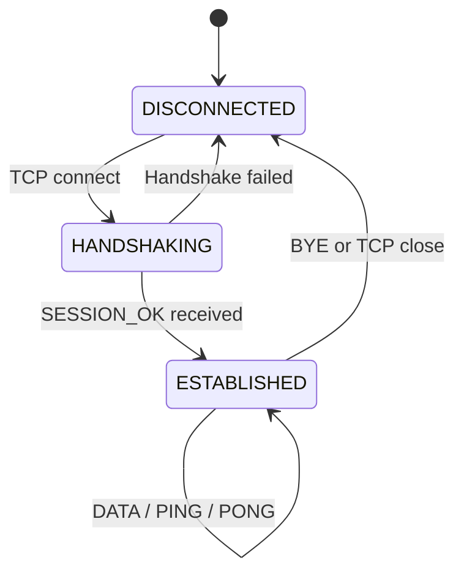

# Protocol Overview

USMP is a layered protocol stack. Each layer has a single, well-defined responsibility.

```txt
┌─────────────────────────────────────────────┐
│              Application Layer              │
│         Your data (bytes, structs)          │
├─────────────────────────────────────────────┤
│               Session Layer                 │
│   Sequence numbers · Replay protection      │
├─────────────────────────────────────────────┤
│               Crypto Layer                  │
│   AES-256-GCM · X25519 · HKDF · HMAC        │
├─────────────────────────────────────────────┤
│               Frame Layer                   │
│   Binary encoding · CRC-16 · Magic bytes    │
├─────────────────────────────────────────────┤
│             Transport Layer                 │
│        TCP · UART · UDP · BLE               │
└─────────────────────────────────────────────┘
```

---

## Packet types

| Value | Name | Direction | Encrypted |
|-------|------|-----------|-----------|
| 0x01 | PKT_HELLO | Client → Server | No |
| 0x02 | PKT_CHALLENGE | Server → Client | No |
| 0x03 | PKT_HELLO_ACK | Client → Server | No |
| 0x04 | PKT_SESSION_OK | Server → Client | No |
| 0x05 | PKT_DATA | Both | Yes |
| 0x06 | PKT_PING | Both | Yes |
| 0x07 | PKT_PONG | Both | Yes |
| 0x08 | PKT_BYE | Both | Yes |
| 0xFF | PKT_ERROR | Both | No |

Handshake frames (0x01–0x04) are always plaintext.
All post-handshake frames (0x05+) are always encrypted.

---

## Connection lifecycle



---

## Sequence numbers

Each direction has an independent sequence counter starting at 0:

```txt
Client TX: 0, 1, 2, 3, ...
Server TX: 0, 1, 2, 3, ...
```

The receiver rejects any frame whose sequence number doesn't match the expected next value. This prevents replay attacks on individual frames.

---

## Deep dives

- [Frame Format](frame-format.md)  -  exact wire encoding
- [Handshake](handshake.md)  -  authentication flow
- [Encryption](encryption.md)  -  crypto details
